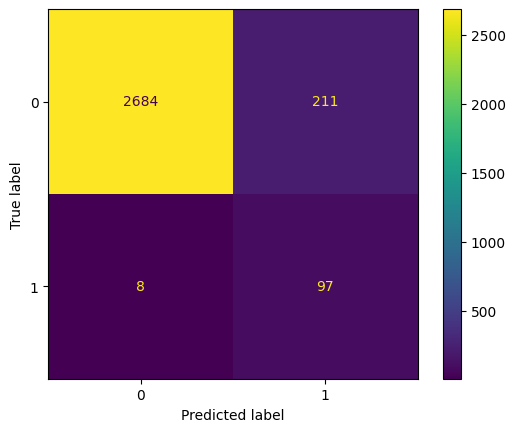

# Mantenimiento predictivo de una fresadora


## ⚙️```Introducción```

En este repositorio, se ha desarrollado un sistema basado en algoritmos de machine learning que permite identificar de manera precisa si una fresadora está en riesgo de fallar o no, así como identificar el modo de falla específico.

El mantenimiento predictivo es una estrategia clave en la industria para evitar costosos tiempos de inactividad y garantizar un funcionamiento eficiente de los equipos. Con la integración del machine learning en este proceso, se ha logrado obtener resultados prometedores al anticipar y prevenir posibles fallas en las fresadoras.

## ✅```​Objetivos```

1. Predecir si la fresadora fallará o no, siguiendo un enfoque de **clasificación binaria**

2. Predecir diferentes modos de falla de la fresadora a través de algoritmos de **clasificación multietiqueta**

## ​🤖​Algoritmos empleados

- **Clasificación Binaria**
  - ```Regresión Logística```
  - ```Árboles de Decisión```
  - ```Random Forest```
  - ```Support Vector Machines (SVM)```
  - ```Cat Boosting```

- **Clasificación Multietiqueta**
  - ```Random Forest Classifier```
  - ```KNeighbors Classifier```
  - ```Support Vector Machines (SVM)```

## ​🛠️```​Desarrollo```

El desarrollo de este proyecto se dividió en 3 partes principales:

1. **Pre-visualización de los datos**: a partir de este análisis se determinó realizar 2 modelos: uno a través de clasificación binaria y otro por medio de clasificación multiclase. Además de constatar que los datos se encuentran desequilibrados.
2. **Clasificación Binaria**: se tomaron en un principio sólo las columnas ```['Type', 'Air_temperature(K)', 'Process_temperature(K)', 'Torque(Nm)',
'Tool_wear(min)', 'Machine_failure','Rotational_speed(rad/s)']```
3. **Clasificación Multietiqueta:** para este caso se tomaron en cuenta (no necesariamente son las features finales) las columnas ```['Type', 'Air_temperature(K)', 'Process_temperature(K)', 'Torque(Nm)', 'Tool_wear(min)', 'Machine_failure', 'TWF', 'HDF', 'PWF', 'OSF', 'RNF','Rotational_speed(rad/s)']```

Tanto en los desarrollos 2 y 3, se realizaron los siguientes pasos:

- **Entrenamiento inicial con datos desequilibrados**: Se evalúa el rendimiento de los modelos en los datos desequilibrados como referencia inicial. Se utilizaron métricas como precision, recall y matriz de confusión para evaluar el desempeño de cada modelo en cada clase (las métricas utilizadas se especifican más adelante).

- **Evaluación de técnicas de equilibrio de datos**: Se aplicaron a modo de prueba diferentes técnicas de equilibrio de datos como oversampling, undersampling y SMOTE-Tomek (las técnicas utilizadas se especifican más adelante), además de la validación cruzada para evaluar junto con otras métricas el rendimiento de cada técnica. Esto permitió obtener una estimación más fiable del rendimiento promedio de cada técnica y se seleccionó la que proporcionó el mejor equilibrio para la clase minoritaria sin que se viera muy afectada la clase mayoritaria.

En este punto fue muy importante responder la siguiente pregunta **¿Es más importante que el modelo prediga correctamente las fallas de la fresadora o que acierte cuando no hay fallas?**

- **Ajuste de hiperparámetros con validación cruzada**: Después de seleccionar la mejor técnica de equilibrio de datos, se utilizó la validación cruzada para ajustar los hiperparámetros de los modelos. Esto implica combinar la técnica de equilibrio de datos seleccionada con una búsqueda de hiperparámetros utilizando GridSearchCV,  RandomizedSearchCV y Optuna en cada modelo.

- **Evaluación final y selección del modelo definitivo**: En esta etapa se realizó una comparación del rendimiento de cada modelo en un escenario equilibrado. Se evaluó métricas como precisión, recall, F1-score y sin dejar de tomar en cuenta la matriz de confusión.

## 🔎```Técnicas y Métricas Utilizadas```

- Técnicas empleadas para equilibrar los datos:
  - Ponderación de clases
  - Subsampling (submuestreo)
  - Oversampling (sobremuestreo)
  - Resampling con Smote-Tomek
  - Balanced Bagging Classifier

Para el modelo binario la técnica que mejores resultados presentó fue **Balanced Bagging Classifier**

- Métricas utilizadas para evaluar el desempeño de los modelos
  - **Precisión**: Es la proporción de veces que el modelo predice correctamente la clase de un dato.
  - **Recall**: Es la proporción de veces que el modelo predice correctamente la clase de un dato que realmente pertenece a esa clase.
  - **F1-Score**: Es una combinación de precisión y recall. Se calcula como la media ponderada de precisión y recall.
  - **Matriz de confusión**: Es una tabla que muestra el número de predicciones correctas e incorrectas del modelo para cada clase.
  - **AUC**: Es el área bajo la curva ROC. Es una medida de la capacidad del modelo para discriminar entre dos clases.

## 📈```​Resultados```

Los resultados del proyecto mostraron que los dos modelos fueron capaces de predecir con precisión si una fresadora fallará. El modelo de clasificación binaria tuvo una precisión del 92%, mientras que el modelo de clasificación multiclase tuvo una precisión del 80%.

### 📌Clasificación Binaria

- Modelo final con técnica de equilibrio de datos y ajuste de hiperparámetros

```python
# Crear el modelo de árbol de decisión
model = DecisionTreeClassifier(random_state=123)

# Crear el clasificador Balanced Bagging
bagging_classifier = BalancedBaggingClassifier(estimator = model, random_state=123)

# Entrenar el modelo con todos los datos de entrenamiento equilibrados
bagging_classifier.fit(X_train, y_train)

# Predicciones con datos equilibrados
y_pred = bagging_classifier.predict(X_test)
```



Donde:

- **Clase 1 (Positive) ➜ Fresadora Falla**
  - **FP (Falsos Positivos)**: cuando la fresadora falló y el modelo predijo que falló, acertó 97 veces
  - **TP (Verdaderos Positivos)**: cuando la fresadora falló y el modelo predijo que no falló, erró 8 veces
- **Clase 0 (Negative) ➜ Fresadora No Falla**
  - **TN (Verdaderos Negativos)**: cuando la fresadora no falló y el modelo predijo que no falló, acertó 2648 veces
  - **FN (Falsos Negativos)**: cuando la fresadora no falló pero el modelo predijo que la fresadora falló, erró 211 veces

| Modelo | Accuracy| Precision |Recall| F1-Score| Training time|Prediction time|
|------|------|------|------|------|------|------|
Decision Tree Classifier (Balanced)|0.927000|0.973155|0.927000|0.94361|1.064231|0.007736|

### 📌Clasificación Multietiqueta

## 💰```​Beneficios de estos modelos```

Los resultados obtenidos demuestran que el uso del aprendizaje automático puede ser altamente efectivo para el mantenimiento predictivo de máquinas fresadoras. Los modelos desarrollados en este proyecto brindan la capacidad de identificar aquellas fresadoras que presentan un alto riesgo de falla, lo que permite tomar medidas preventivas para evitar o mitigar dichas fallas.

No obstante, es importante tener en cuenta algunos desafíos comunes que pueden surgir en un proyecto de machine learning para el mantenimiento predictivo:

- **Disponibilidad de datos**: Para lograr resultados precisos, es fundamental contar con un conjunto de datos de alta calidad y una cantidad suficiente para entrenar el modelo de manera efectiva.

- **Complejidad del problema**: La predicción de fallas puede ser un desafío complejo debido a la multiplicidad de factores que pueden contribuir a una falla en las máquinas fresadoras. Es necesario considerar y capturar adecuadamente todas las variables relevantes para obtener resultados confiables.

- **Costo y tiempo**: Los proyectos de machine learning pueden requerir una inversión significativa tanto en términos de recursos financieros como de tiempo. Es importante asignar recursos adecuados para la recopilación y preparación de datos, el entrenamiento del modelo y la implementación del sistema de mantenimiento predictivo.

A pesar de estos desafíos, el mantenimiento predictivo sigue siendo una estrategia eficaz que puede ayudar a las empresas a reducir los costos de mantenimiento y mejorar la disponibilidad de sus equipos. Al abordar estos desafíos de manera adecuada y contar con un enfoque sólido, es posible obtener beneficios significativos en términos de eficiencia y rendimiento de las fresadoras.

## ​📤```​Fuente de los datos```

This dataset is part of the following publication, please cite when using this dataset:
S. Matzka, "Explainable Artificial Intelligence for Predictive Maintenance Applications," 2020 Third International Conference on Artificial Intelligence for Industries (AI4I), 2020, pp. 69-74, doi: 10.1109/AI4I49448.2020.00023.

[AI4I 2020 Predictive Maintenance Dataset](https://archive.ics.uci.edu/dataset/601/ai4i+2020+predictive+maintenance+dataset)

## 👩‍💻 ```Desarrollador```

Si deseas contactarme, simplemente haz clic sobre mi nombre y serás redirigido a mi perfil de LinkedIn. Estaré encantada 🤗 de responder a tus consultas y compartir más detalles sobre mis habilidades y experiencia.

<div align="center">

*Data Scientist*
| [<br><sub>Danniela Rodríguez</sub>](https://www.linkedin.com/in/danniela-rodriguez-jove-/)
| :---: |

<div align="left">

## 🙌 ```Agradecimiento y Actualizaciones```

*¡Gracias por revisar este proyecto* 🤗! *Si deseas estar al tanto de futuras actualizaciones, te invito a marcar el repositorio con un estrella* ⭐​. *Puedes encontrar la opción para hacerlo en la parte superior derecha de la página. Tu apoyo es muy apreciado.*